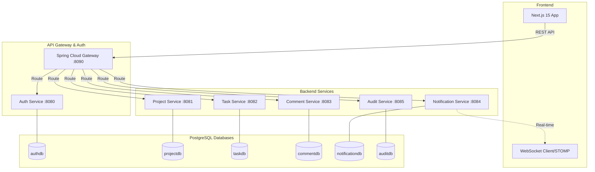
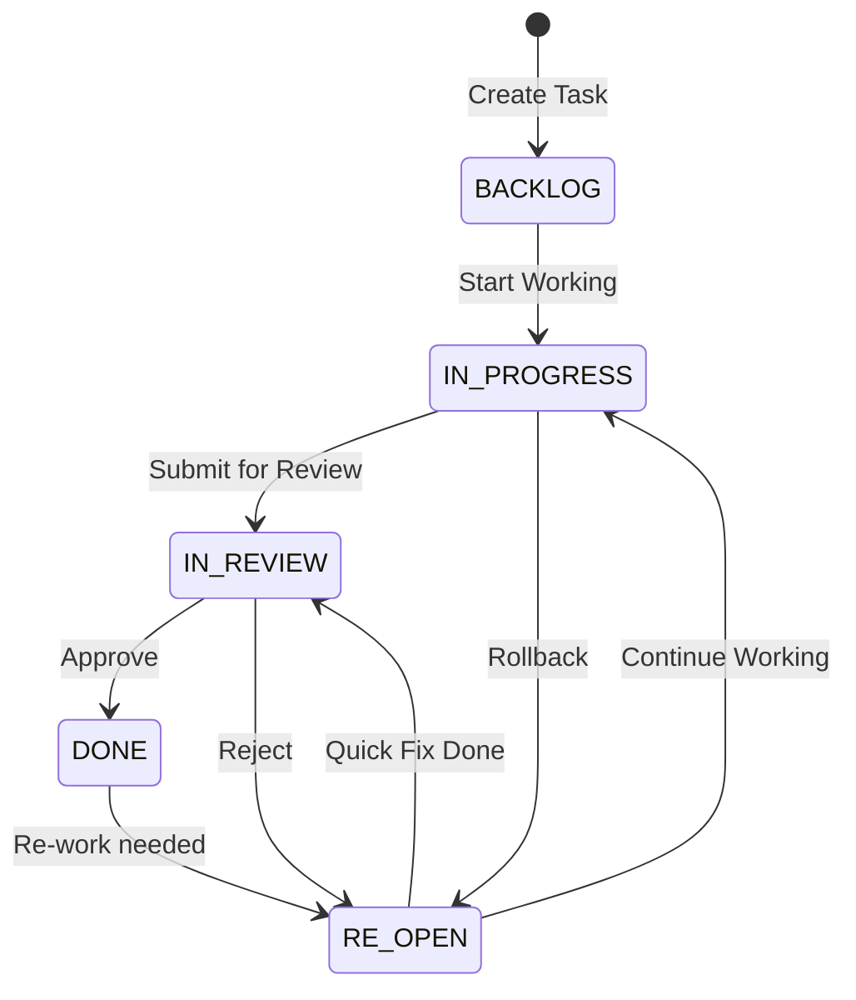
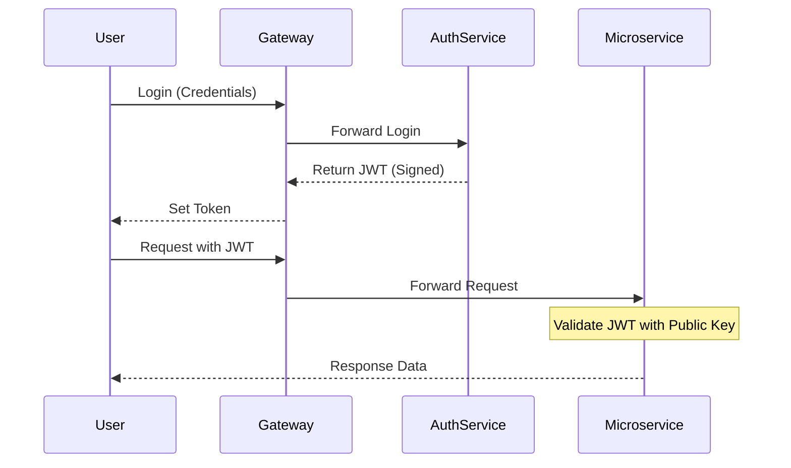

# ProjectFlow - Hệ quản trị dự án Microservices

Hệ thống quản lý dự án (Project Management System) hiện đại được thiết kế theo kiến trúc Microservices, lấy cảm hứng từ Jira và Linear. 

---

## 🏗️ Kiến trúc & Công nghệ

### Sơ đồ Kiến trúc Tổng thể (Architecture)



### Công nghệ sử dụng
- **Backend**: Spring Boot 3.2, Java 21, Spring Cloud Gateway, Spring Security (JWT RS256).
- **Frontend**: Next.js 15 (App Router), React 19, Zustand, TailwindCSS, Framer Motion.
- **Dữ liệu**: PostgreSQL 16, Flyway (Migration).
- **Giao tiếp**: REST API, WebSocket (STOMP).
- **Triển khai**: Docker & Docker Compose.

---

## 🔄 Luồng Nghiệp vụ (Workflow)

### Quản lý trạng thái Task (Strict State Machine)

Hệ thống bắt buộc task phải đi qua các bước kiểm duyệt để đảm bảo chất lượng:



### Đặc điểm nổi bật:
- **RE-OPENED Badge**: Task bị trả về sẽ có nhãn đỏ nổi bật.
- **WIP Limits**: Giới hạn số lượng task đang làm (In Progress) để tránh quá tải team.
- **Audit Trace**: Mọi thay đổi trạng thái đều được ghi lại trong `Audit Service`.

---

## 🚀 Hướng dẫn cài đặt & Chạy ứng dụng

### 1. Chuẩn bị (Prerequisites)
- **Docker Desktop** (để chạy Database và môi trường Container).
- **Node.js 18+** (để chạy Frontend).
- **Java 21** (chỉ nếu muốn chạy Local không qua Docker).

### 2. Cấu hình Môi trường
```bash
cp .env.example .env
```

### 3. Cách chạy dự án (Windows)

#### Cách A: Chạy bằng Docker (Khuyên dùng)
Xây dựng và chạy toàn bộ Backend Services bên trong Container:
```powershell
.\start-docker.ps1
```

#### Cách B: Chạy Local (Cho Developer muốn Debug)
Chạy Database qua Docker, sau đó chạy trực tiếp mã nguồn Backend trên máy:
```powershell
.\start-local.ps1
```

#### Cách C: Runner Tổng hợp (Interactive)
Sử dụng menu tương tác để chọn chế độ chạy:
```powershell
.\run.ps1
```

---

## 📂 Cấu trúc thư mục

| Thư mục | Chức năng |
|---|---|
| `api-gateway/` | Định tuyến, xử lý CORS, bảo mật trung tâm. |
| `common-lib/` | Thư viện dùng chung (JWT Validator, DTOs, Exceptions). |
| `project-service/` | Quản lý không gian làm việc, dự án, phân quyền Member. |
| `task-service/` | Quản lý Kanban, Task, Trạng thái, WIP Limits. |
| `comment-service/` | Xử lý thảo luận, bình luận trong Task. |
| `notification-service/` | Đẩy thông báo Web (WebSocket) & Lưu trữ thông báo. |
| `audit-service/` | Lưu nhật ký hoạt động (Audit Logs). |
| `frontend/` | Giao diện người dùng Next.js hiện đại. |

---

## 🔐 Bảo mật & Xác thực

Hệ thống sử dụng cơ chế **Decentralized Authentication**:
1. `Auth Service` cấp JWT được ký bằng Private Key (RSA).
2. Các Microservices khác sử dụng Public Key (thông qua `JwtValidator` trong `common-lib`) để tự xác thực Token mà không cần gọi lại Auth Service.



---

## 👩‍💻 Thông tin Tài khoản Mặc định
- **URL**: [http://localhost:3000](http://localhost:3000)
- **Tài khoản**: `admin`
- **Mật khẩu**: `Admin@123`

---

## 🔗 Liên kết Tham khảo
- **Hệ thống Auth (Gốc)**: [https://github.com/Hikaru203/auth](https://github.com/Hikaru203/auth)
- **Project Manager Repo**: [https://github.com/Hikaru203/project-manager.git](https://github.com/Hikaru203/project-manager.git)
