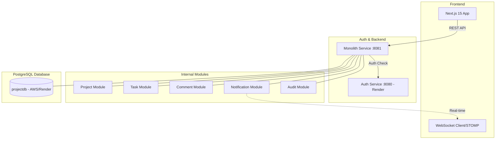

# ProjectFlow - Monolith Backend

Hệ thống quản lý dự án (Project Management System) hiện đại được thiết kế theo kiến trúc Monolith (hợp nhất từ Microservices), lấy cảm hứng từ Jira và Linear. 

---

## 🏗️ Kiến trúc & Công nghệ

### Sơ đồ Kiến trúc Tổng thể (Architecture)



### Công nghệ sử dụng
- **Backend**: Spring Boot 3.2, Java 21, Spring Security (JWT RS256).
- **Frontend**: Next.js 15 (App Router), React 19, Zustand, TailwindCSS, Framer Motion.
- **Dữ liệu**: PostgreSQL 16, Flyway (Migration).
- **Giao tiếp**: REST API, WebSocket (STOMP).
- **Triển khai**: Docker & Render (Free Tier Optimized).

---

## 🚀 Hướng dẫn cài đặt & Chạy ứng dụng

### 1. Chạy Local (Cho Developer)
1. **Frontend**:
   ```bash
   cd frontend
   npm install
   npm run dev
   ```
2. **Backend (Monolith)**:
   ```bash
   mvn clean package -pl monolith-service -am -DskipTests
   java -jar monolith-service/target/monolith-service-1.0.0.jar
   ```

### 2. Chạy bằng Docker
Hệ thống đã được cấu hình sẵn Docker Compose để chạy toàn bộ môi trường:
```powershell
docker-compose up --build
```

### 3. Hướng dẫn Triển khai (Deployment)

#### A. Backend (Monolith & Auth) -> [Render](https://render.com)
1. **Tạo Web Service**: Kết nối với GitHub của bạn.
2. **Cấu hình Monolith**:
   - **Build Command**: `mvn clean package -DskipTests`
   - **Start Command**: `java -jar monolith-service/target/monolith-service-1.0.0.jar`
   - **Environment Variables**:
     - `PORT`: 8081
     - `SPRING_DATASOURCE_URL`: (Render Postgres URL)
     - `ALLOWED_ORIGINS`: (URL Vercel của bạn)
3. **Cấu hình Auth**: Tương tự như Monolith nhưng dùng project `auth-src`.

#### B. Frontend -> [Vercel](https://vercel.com)
1. **Tạo Project**: Chọn thư mục `frontend`.
2. **Framework Preset**: Next.js.
3. **Environment Variables**:
   - `NEXT_PUBLIC_AUTH_URL`: `https://pm-auth-service.onrender.com`
   - `NEXT_PUBLIC_API_URL`: `https://your-monolith-service.onrender.com`

---

## 🔐 Lưu ý Quan trọng khi Deploy
- **CORS**: Luôn đảm bảo `ALLOWED_ORIGINS` trên server khớp với domain frontend.
- **HTTPS**: Tất cả URL Production phải bắt đầu bằng `https://`.
- **Database**: Sử dụng PostgreSQL trên Cloud (như Render hoặc Supabase) để dữ liệu không bị mất khi restart service.

---

## 📂 Cấu trúc thư mục

| Thư mục | Chức năng |
|---|---|
| `monolith-service/` | Backend hợp nhất (Project, Task, Comment, Notification, Audit). |
| `common-lib/` | Thư viện dùng chung (JWT Validator, DTOs, Exceptions). |
| `frontend/` | Giao diện người dùng Next.js hiện đại. |

---

## 👩‍💻 Thông tin Tài khoản Mặc định
- **Tài khoản**: `admin`
- **Mật khẩu**: `Admin@123`

---

## 🔗 Liên kết Tham khảo
- **Hệ thống Auth (Gốc)**: [https://github.com/Hikaru203/auth](https://github.com/Hikaru203/auth)
- **Project Manager Repo**: [https://github.com/Hikaru203/project-manager.git](https://github.com/Hikaru203/project-manager.git)
