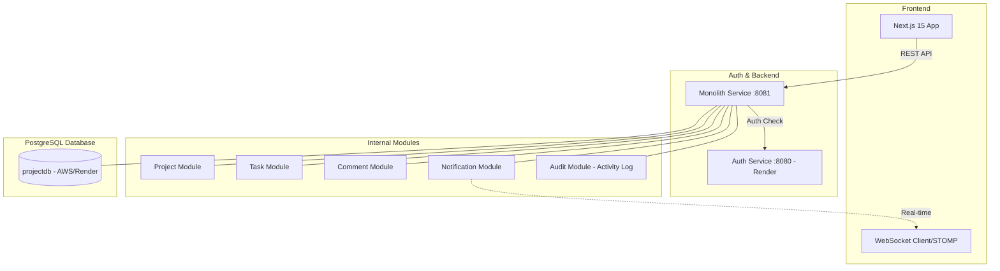
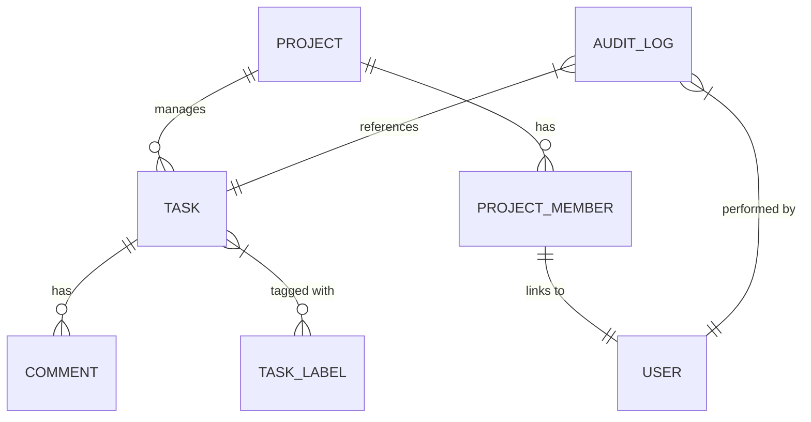
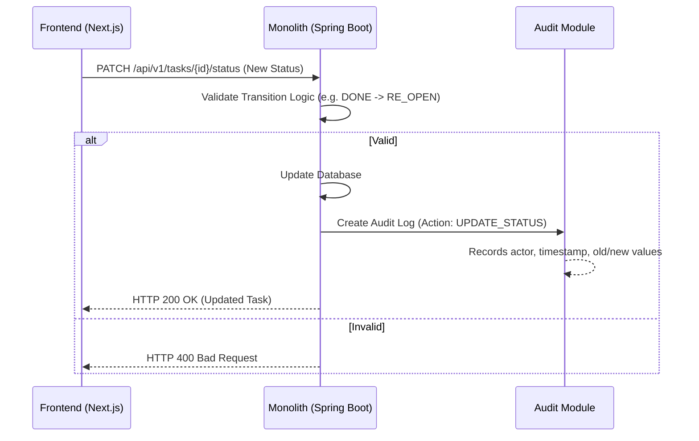

# ProjectFlow - Modern Project Management System

A modern project management system designed with a Monolith architecture (evolved from microservices), inspired by Jira and Linear.

- [English](README.md) | [Tiếng Việt](README_VI.md) | [中文](README_ZH.md)

---

## 🏗️ Architecture & Technology

### Overall Architecture



### Data Model (ER Diagram)
Understand the relationships between entities in the system:



### Task Status Update Flow (Sequence)
Describes how the system handles task status updates:



### Technology Stack
- **Backend**: Spring Boot 3.2, Java 21, Spring Security (JWT RS256).
- **Frontend**: Next.js 15 (App Router), React 19, Zustand, TailwindCSS, Framer Motion.
- **Data**: PostgreSQL 16, Flyway (Migration).
- **Communication**: REST API, WebSocket (STOMP), Secure API Key Signatures.
- **Key Features**: 
  - **Activity Log**: Tracks every change (task creation, status updates, member additions) with an intuitive timeline interface.
  - **Smart Task Status**: Supports flexible "Re-open" workflows and automatic status transitions during drag-and-drop.
- **Deployment**: Docker & Render (Free Tier Optimized).

---

## 🚀 Installation & Getting Started

### 1. Running Locally (For Developers)
1. **Frontend**:
   ```bash
   cd frontend
   cp .env.example .env.local # Configure API URLs here
   npm install
   npm run dev
   ```
2. **Backend (Monolith)**:
   ```bash
   cd monolith-service
   cp .env.example .env # Configure Database & Auth API Key here
   mvn clean package -pl monolith-service -am -DskipTests
   java -jar target/monolith-service-1.0.0.jar
   ```

### 2. Running with Docker
The system is pre-configured with Docker Compose:
```powershell
docker-compose up --build
```

### 3. Deployment Guide

#### A. Backend (Monolith & Auth) -> [Render](https://render.com)
1. **Create Web Service**: Connect your GitHub repository.
2. **Configure Monolith**:
   - **Environment**: `Docker`
   - **Dockerfile Path**: `monolith-service/Dockerfile`
   - **Environment Variables**:
     - `PORT`: 8081
     - `SPRING_DATASOURCE_URL`: (Render Postgres URL)
     - `ALLOWED_ORIGINS`: (Your Vercel URL)
3. **Configure Auth Service**: Same as above but pointing to the `auth-src` project.

#### B. Frontend -> [Vercel](https://vercel.com)
1. **Create Project**: Select the `frontend` folder.
2. **Environment Variables**:
   - `NEXT_PUBLIC_AUTH_URL`: `https://pm-auth-service.onrender.com`
   - `NEXT_PUBLIC_API_URL`: `https://your-monolith-service.onrender.com`

---

## 🔐 Important Notes for Deployment
- **CORS**: Ensure `ALLOWED_ORIGINS` on the server matches your frontend domain.
- **HTTPS**: All Production URLs must use `https://`.
- **Database**: Use Cloud PostgreSQL (Render/Supabase) to persist data across restarts.

---

## 📂 Directory Structure

| Folder | Description |
|---|---|
| `monolith-service/` | Unified backend (Project, Task, Comment, Notification, Audit). |
| `common-lib/` | Shared libraries (JWT Validator, DTOs, Exceptions). |
| `frontend/` | Modern Next.js user interface. |

### Backend Monolith Details
```text
monolith-service/
├── src/main/java/com/projectmanager/
│   ├── project/         # Project & Member Management
│   ├── task/            # Task Management, Status, Labels
│   ├── comment/         # Task Discussion
│   ├── audit/           # Activity Log System (Audit)
│   ├── notification/    # Notifications (Real-time & DB)
│   └── common/          # Security, Exception, Base DTOs
└── src/main/resources/
    └── db/migration/    # Database History (Flyway)
```

---

## 👩‍💻 Default Credentials
- **Account**: `admin`
- **Password**: `Admin@123`

---

## 🔗 Reference Links
- **Auth System (Original)**: [https://github.com/Hikaru203/auth](https://github.com/Hikaru203/auth)
- **Project Manager Repo**: [https://github.com/Hikaru203/project-manager.git](https://github.com/Hikaru203/project-manager.git)
