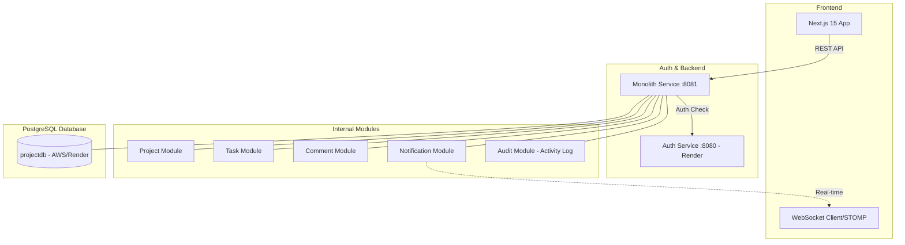
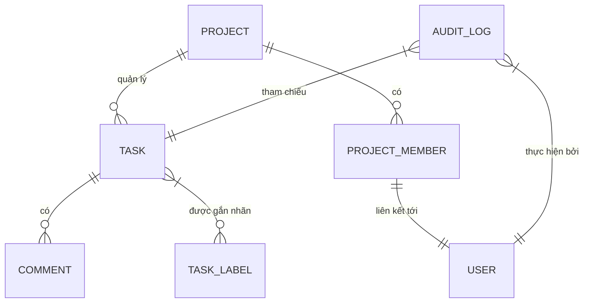
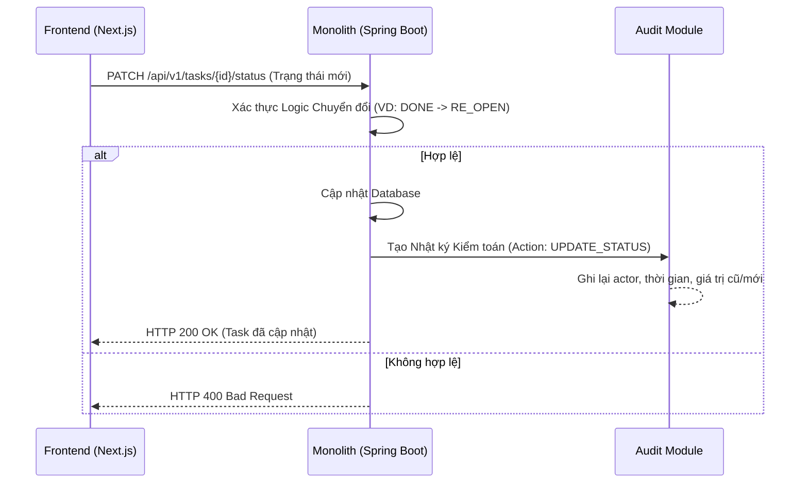

# ProjectFlow - Hệ thống quản lý dự án hiện đại

Hệ thống quản lý dự án (Project Management System) hiện đại được thiết kế theo kiến trúc Monolith (phát triển từ microservices), lấy cảm hứng từ Jira và Linear.

- [English](README.md) | [Tiếng Việt](README_VI.md) | [中文](README_ZH.md)

---

## 🏗️ Kiến trúc & Công nghệ

### Sơ đồ Kiến trúc Tổng thể



### Mô hình dữ liệu (ER Diagram)
Hiểu rõ mối quan hệ giữa các thực thể trong hệ thống:



### Luồng cập nhật trạng thái Task (Sequence)
Mô tả cách hệ thống xử lý cập nhật trạng thái nhiệm vụ:



### Công nghệ sử dụng
- **Backend**: Spring Boot 3.2, Java 21, Spring Security (JWT RS256).
- **Frontend**: Next.js 15 (App Router), React 19, Zustand, TailwindCSS, Framer Motion.
- **Dữ liệu**: PostgreSQL 16, Flyway (Migration).
- **Giao tiếp**: REST API, WebSocket (STOMP), Secure API Key Signatures.
- **Tính năng nổi bật**: 
  - **Activity Log**: Theo dõi mọi thay đổi (tạo task, cập nhật trạng thái, thêm thành viên) với giao diện timeline trực quan.
  - **Smart Task Status**: Hỗ trợ quy trình "Re-open" linh hoạt và tự động chuyển trạng thái khi kéo thả.
- **Triển khai**: Docker & Render (Tối ưu cho gói miễn phí).

---

## 🚀 Hướng dẫn cài đặt & Khởi chạy

### 1. Chạy Local (Cho Lập trình viên)
1. **Frontend**:
   ```bash
   cd frontend
   cp .env.example .env.local # Cấu hình API URLs tại đây
   npm install
   npm run dev
   ```
2. **Backend (Monolith)**:
   ```bash
   cd monolith-service
   cp .env.example .env # Cấu hình Database & Auth API Key tại đây
   mvn clean package -pl monolith-service -am -DskipTests
   java -jar target/monolith-service-1.0.0.jar
   ```

### 2. Chạy với Docker
Hệ thống đã được cấu hình sẵn với Docker Compose:
```powershell
docker-compose up --build
```

### 3. Hướng dẫn Triển khai

#### A. Backend (Monolith & Auth) -> [Render](https://render.com)
1. **Tạo Web Service**: Kết nối kho lưu trữ GitHub của bạn.
2. **Cấu hình Monolith**:
   - **Môi trường**: `Docker`
   - **Đường dẫn Dockerfile**: `monolith-service/Dockerfile`
   - **Biến môi trường**:
     - `PORT`: 8081
     - `SPRING_DATASOURCE_URL`: (Render Postgres URL)
     - `ALLOWED_ORIGINS`: (URL Vercel của bạn)
3. **Cấu hình Auth Service**: Tương tự như trên nhưng trỏ đến dự án `auth-src`.

#### B. Frontend -> [Vercel](https://vercel.com)
1. **Tạo Dự án**: Chọn thư mục `frontend`.
2. **Biến môi trường**:
   - `NEXT_PUBLIC_AUTH_URL`: `https://pm-auth-service.onrender.com`
   - `NEXT_PUBLIC_API_URL`: `https://your-monolith-service.onrender.com`

---

## 🔐 Lưu ý quan trọng khi Triển khai
- **CORS**: Đảm bảo `ALLOWED_ORIGINS` trên máy chủ khớp với tên miền frontend của bạn.
- **HTTPS**: Tất cả các URL Production phải sử dụng `https://`.
- **Database**: Sử dụng Cloud PostgreSQL (Render/Supabase) để bảo toàn dữ liệu khi khởi động lại.

---

## 📂 Cấu trúc thư mục

| Thư mục | Mô tả |
|---|---|
| `monolith-service/` | Backend hợp nhất (Project, Task, Comment, Notification, Audit). |
| `common-lib/` | Thư viện dùng chung (JWT Validator, DTOs, Exceptions). |
| `frontend/` | Giao diện người dùng Next.js hiện đại. |

### Chi tiết Backend Monolith
```text
monolith-service/
├── src/main/java/com/projectmanager/
│   ├── project/         # Quản lý Dự án & Thành viên
│   ├── task/            # Quản lý Task, Trạng thái, Nhãn
│   ├── comment/         # Thảo luận trong Task
│   ├── audit/           # Hệ thống Nhật ký Hoạt động (Audit)
│   ├── notification/    # Thông báo (Real-time & DB)
│   └── common/          # Bảo mật, Xử lý lỗi, DTO cơ sở
└── src/main/resources/
    └── db/migration/    # Lịch sử Database (Flyway)
```

---

## 👩‍💻 Thông tin đăng nhập mặc định
- **Tài khoản**: `admin`
- **Mật khẩu**: `Admin@123`

---

## 🔗 Liên kết tham khảo
- **Hệ thống Auth (Gốc)**: [https://github.com/Hikaru203/auth](https://github.com/Hikaru203/auth)
- **Project Manager Repo**: [https://github.com/Hikaru203/project-manager.git](https://github.com/Hikaru203/project-manager.git)
