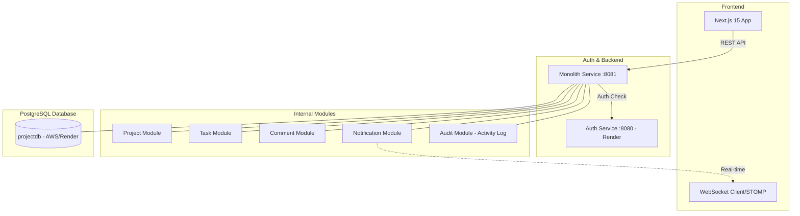
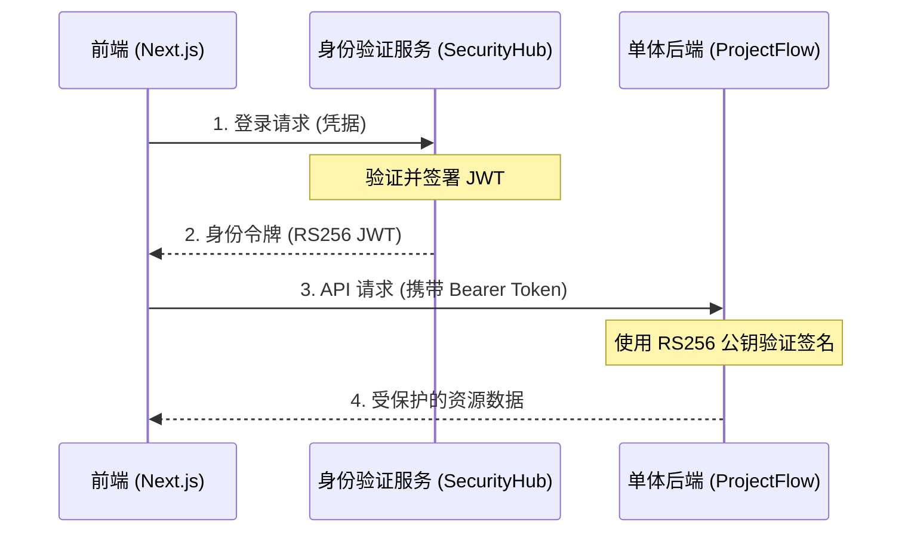
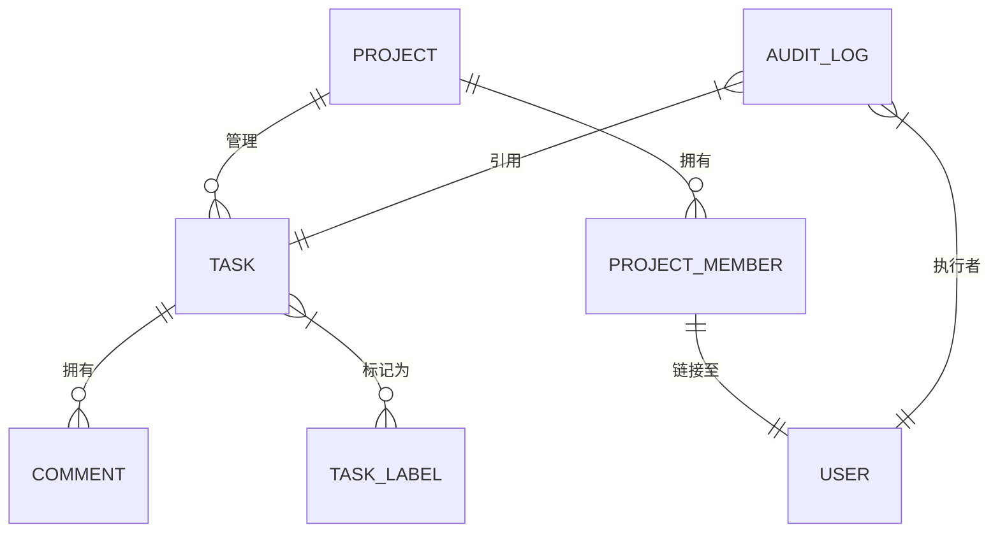
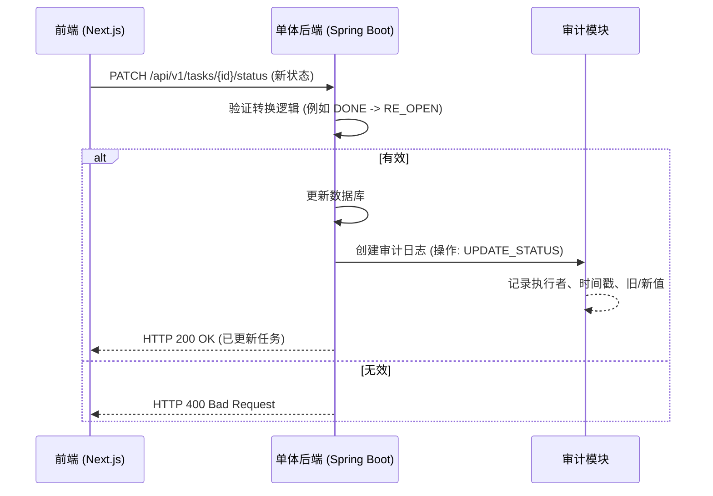

# ProjectFlow - 现代项目管理系统

一个采用单体架构（由微服务演变而来）设计的现代项目管理系统，灵感源自 Jira 和 Linear。

- [English](README.md) | [Tiếng Việt](README_VI.md) | [中文](README_ZH.md)

---

## 🏗️ 架构与技术

### 总体架构图



### 🔐 为什么需要独立的身份验证服务?
ProjectFlow 将安全和身份管理卸载到 **SecurityHub**（Auth Service），原因如下：

1.  **安全隔离**: 敏感操作（如 BCrypt 密码哈希和 RS256 私钥签名）被隔离在加固的环境中。
2.  **无状态扩展**: 通过使用 **RS256 非对称加密**，单体应用可以使用**公钥**验证用户身份，而无需为每个请求查询身份验证服务或数据库。
3.  **集中式多租户**: 组织（租户）边界在身份级别强制执行，使系统天然具备企业级能力。

#### 身份验证流程图


### 数据模型 (ER 图)
了解系统中各实体之间的关系：



### 任务状态更新流 (时序图)
描述系统如何处理任务状态更新：



### 技术栈
- **后端**: Spring Boot 3.2, Java 21, Spring Security (JWT RS256).
- **前端**: Next.js 15 (App Router), React 19, Zustand, TailwindCSS, Framer Motion.
- **数据**: PostgreSQL 16, Flyway (Migration).
- **通信**: REST API, WebSocket (STOMP), Secure API Key Signatures.
- **核心功能**: 
  - **活动日志 (Activity Log)**: 跟踪每一项更改（创建任务、更新状态、添加成员），并配有直观的时间轴界面。
  - **智能任务状态**: 支持灵活的 "Re-open" 流程，并在拖放期间自动切换状态。
- **部署**: Docker & Render (针对免费套餐优化)。

---

## 🚀 安装与启动指南

### 1. 本地运行 (开发人员)
1. **前端**:
   ```bash
   cd frontend
   cp .env.example .env.local # 在此处配置 API URL
   npm install
   npm run dev
   ```
2. **后端 (单体服务)**:
   ```bash
   cd monolith-service
   cp .env.example .env # 在此处配置数据库和 Auth API Key
   mvn clean package -pl monolith-service -am -DskipTests
   java -jar target/monolith-service-1.0.0.jar
   ```

### 2. 使用 Docker 运行
系统已预先配置 Docker Compose：
```powershell
docker-compose up --build
```

### 3. 部署指南

#### A. 后端 (单体 & Auth) -> [Render](https://render.com)
1. **创建 Web 服务**: 连接您的 GitHub 仓库。
2. **配置单体服务**:
   - **环境**: `Docker`
   - **Dockerfile 路径**: `monolith-service/Dockerfile`
   - **环境变量**:
     - `PORT`: 8081
     - `SPRING_DATASOURCE_URL`: (Render Postgres URL)
     - `ALLOWED_ORIGINS`: (您的 Vercel URL)
3. **配置 Auth 服务**: 同上，但指向 `auth-src` 项目。

#### B. 前端 -> [Vercel](https://vercel.com)
1. **创建项目**: 选择 `frontend` 文件夹。
2. **环境变量**:
   - `NEXT_PUBLIC_AUTH_URL`: `https://pm-auth-service.onrender.com`
   - `NEXT_PUBLIC_API_URL`: `https://your-monolith-service.onrender.com`

---

## 🔐 部署注意事项
- **CORS**: 确保服务器上的 `ALLOWED_ORIGINS` 与您的前端域名匹配。
- **HTTPS**: 所有生产环境 URL 必须使用 `https://`。
- **数据库**: 使用云端 PostgreSQL (Render/Supabase) 以便在重启时保留数据。

---

## 📂 目录结构

| 文件夹 | 描述 |
|---|---|
| `monolith-service/` | 统一后端 (项目、任务、评论、通知、审计)。 |
| `common-lib/` | 共享库 (JWT 验证器、DTO、异常)。 |
| `frontend/` | 现代 Next.js 用户界面。 |

### 后端单体服务细节
```text
monolith-service/
├── src/main/java/com/projectmanager/
│   ├── project/         # 项目与成员管理
│   ├── task/            # 任务管理、状态、标签
│   ├── comment/         # 任务讨论
│   ├── audit/           # 活动日志系统 (审计)
│   ├── notification/    # 通知 (实时与数据库)
│   └── common/          # 安全、异常、基础 DTO
└── src/main/resources/
    └── db/migration/    # 数据库历史 (Flyway)
```

---

## 👩‍💻 默认凭据
- **账号**: `admin`
- **密码**: `Admin@123`

---

## 🔗 参考链接
- **身份验证系统 (原始)**: [https://github.com/Hikaru203/auth](https://github.com/Hikaru203/auth)
- **项目管理仓库**: [https://github.com/Hikaru203/project-manager.git](https://github.com/Hikaru203/project-manager.git)
